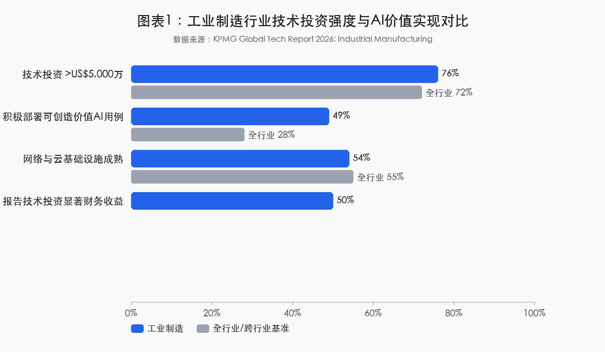
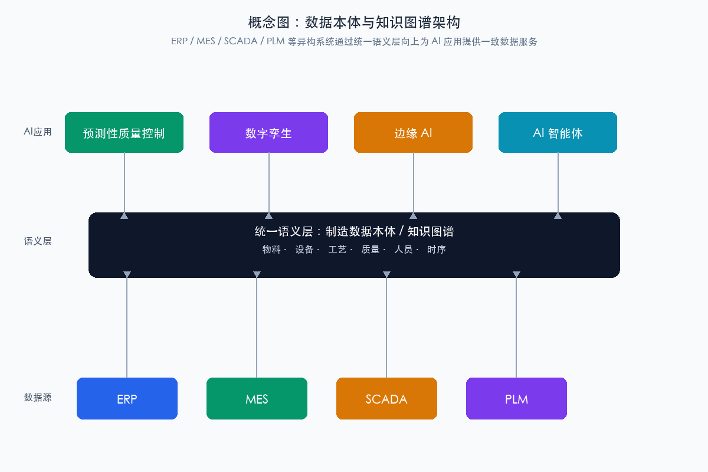
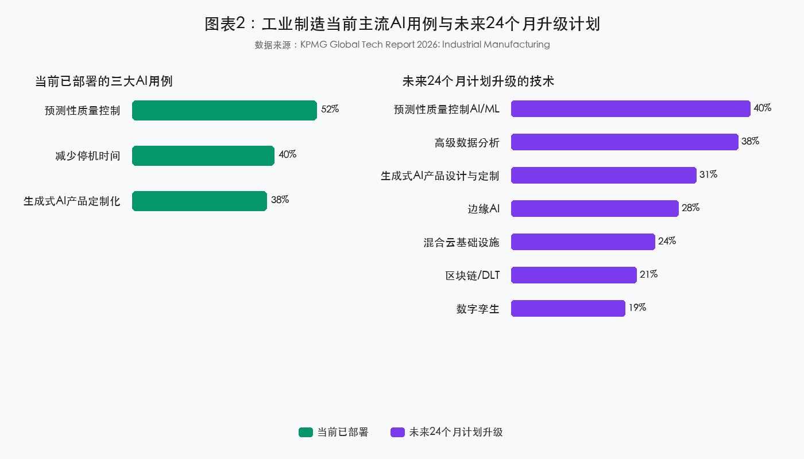
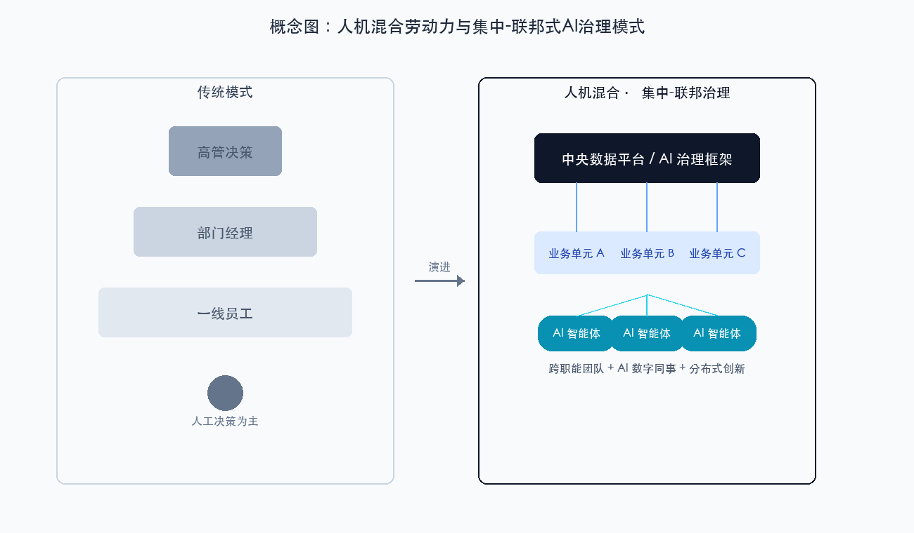
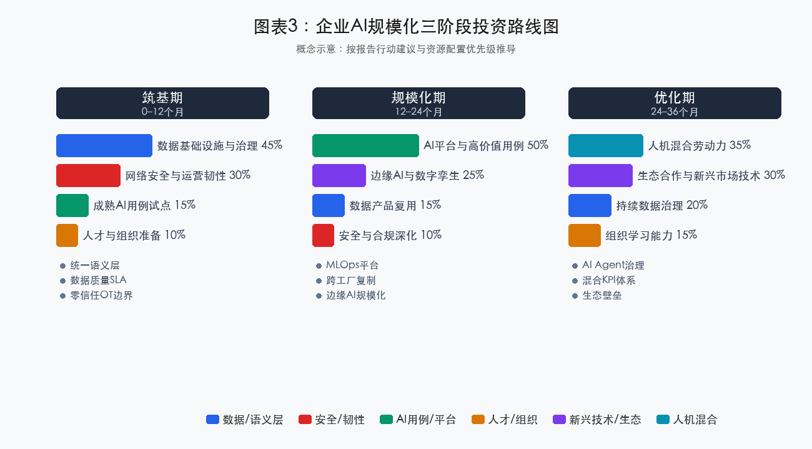

# KPMG 2026 年全球科技报告：工业制造篇解读：AI 规模化竞争中的数据、组织与安全

> **原文**：Global Tech Report 2026: Industrial Manufacturing  
> **来源**：KPMG International（毕马威国际）  
> **发布时间**：2026 年 4 月  
> **调研范围**：全球 22 个国家与地区，258 位年收入超过 US$10 亿的工业制造企业 C 套件高管与职能负责人  
> **细分样本**：其他工程与工业产品 113 家、航空航天与国防 53 家、太空 50 家、金属与先进材料 42 家  
> **解读人**：树懒老K  
> **解读日期**：2026-06-23

---

## 一、决策者摘要

KPMG 2026 年全球科技报告之工业制造篇显示，**工业制造行业已进入技术投资高峰期**：76% 的受访企业技术投资额超过 US$5,000 万，49% 已积极部署可创造业务价值的 AI 用例（跨行业平均仅 28%），近半数（约 50%）的高管报告技术投资带来显著财务收益。AI 不再是概念验证（Proof of Concept, PoC）阶段的实验技术，而是正在进入 CEO 的资本配置议程。

然而，比乐观数字更值得警惕的是三组“剪刀差”：**83% 的高管自信数据管理良好，但 76% 同时将数据可靠性不足列为未来两年 AI 的首要风险；70% 采取集中式 AI 治理，但 87% 强调跨职能协作至关重要；85% 计划向人机混合劳动力转型，但仅 65% 的员工足够信任 AI 输出**。这些信号说明，工业制造的 AI 竞争已经从“算法竞赛”转向“数据工程、系统集成、安全治理与组织吸收能力的综合竞赛”。

我们的判断是：未来 12–24 个月，决定胜负的不再是“投不投 AI”，而是**能否在数据语义层、组织变革和安全韧性三条腿上同时接稳**。报告中的漂亮数字是领先者的成绩单，不是大多数企业的起跑线。

---

## 二、报告背景与核心发现

### 2.1 报告背景

KPMG 本次调研覆盖全球 22 个国家与地区，258 位年收入超过 US$10 亿的工业制造企业高管与职能负责人。样本细分为四类：其他工程与工业产品（113 家，43.8%）、航空航天与国防（53 家，20.5%）、太空（50 家，19.4%）、金属与先进材料（42 家，16.3%）。报告试图回答三个相互关联的问题：

1. 工业制造企业如何在技术投资中实现可衡量的财务与运营回报？
2. 企业应采用何种组织架构与运营模式，将 AI 从试点推向规模化部署？
3. 在数据、安全、人才与新兴技术方面，企业需要构建哪些底层能力？

### 2.2 核心论点

报告提出六个相互支撑的论点：

- **论点一：工业制造在技术成熟度与 AI 规模化意愿上领先跨行业平均水平**。54% 的高管认为网络与云基础设施成熟（仅次于消费与零售的 55%）；49% 积极部署创造业务价值的 AI 用例，显著高于跨行业平均 28%。
- **论点二：AI 的财务贡献已从“未来愿景”转向“现实收益”**。49% 的受访者表示 AI 已带来显著财务收益或贡献，占已实现数字总价值的 31%–40%；近半数（约 50%）的高管报告技术投资整体带来显著财务收益。
- **论点三：数据质量是 AI 成功落地的底层变量，但企业呈现“信心与警觉并存”的矛盾心态**。83% 认为数据管理处于良好或优化状态，76% 却将数据可靠性不足列为未来两年 AI 的首要风险。
- **论点四：网络安全正从“成本中心”重新定位为“价值创造要素”**。48% 计划未来 12 个月显著增加网络安全投资，34% 将增强网络安全列为技术投资最大收益之一，仅次于运营效率提升（41%）。
- **论点五：AI 的最大价值在于与其他新兴技术的组合应用**。AI 与数字孪生（Digital Twin）、边缘计算（Edge Computing）、软件驱动自动化（Software-Driven Automation, SDA）等技术的协同，是打造灵活、韧性、实时响应运营体系的关键路径。
- **论点六：组织变革与人才能力是技术价值兑现的关键瓶颈**。70% 采取集中式 AI 推进方式，87% 强调跨职能协作，89% 认为未来五年管理 AI 智能体（AI Agents）将成为重要技能。

### 2.3 关键数据速览

| 维度 | 指标 | 数据 | 置信度/限定条件 |
|---|---|---|---|
| 投资强度 | 技术投资额超过 US$5,000 万的企业比例 | 76%（全行业平均 72%） | High；大型企业样本 |
| 价值实现 | 报告技术投资带来显著财务收益的高管比例 | 50% | Medium；高管自评，缺乏量化标准 |
| AI 落地 | 积极部署可创造业务价值 AI 用例的比例 | 49%（一年前 42%，跨行业 28%） | High；含自评成分 |
| AI 收益 | AI 收益占已实现数字总价值的比例区间 | 31%–40% | Medium；区间估计含义不明 |
| 数据 | 认为数据管理良好或优化的比例 / 将数据不可靠列为首要风险的比例 | 83% / 76% | Medium/High；反映高管矛盾心态 |
| 安全 | 计划未来 12 个月显著增加网络安全投资的比例 | 48% | High（当前意向） |
| 组织 | 采取集中式 AI 治理 / 认为跨职能协作至关重要的比例 | 70% / 87% | High |
| 人才 | 认为管理 AI 智能体将成为重要技能 / 人才招聘包含 AI 原生角色的比例 | 89% / 81% | High/Medium；反映预期与策略 |

> **图1 应呈现**：工业制造与全行业在技术投资额超过 US$5,000 万比例、报告显著财务收益比例、积极部署 AI 用例比例、AI 收益占数字总价值区间等核心指标的对比；数据来源：KPMG Global Tech Report 2026。

---

## 三、多维解读

### 3.1 技术视角：从“算法可用”到“数据语义与系统集成”

#### 3.1.1 技术成熟度分层

基于报告数据与外部对照源，我们将工业制造相关技术划分为三层：

| 层级 | 代表技术/用例 | 报告中的高管信号 | 专家判断 |
|---|---|---|---|
| **已可规模化** | 基于 ML 的预测性质量控制、减少停机时间、高级数据分析、混合云数据平台、零信任架构原则 | 52% 已部署预测性质量控制；40% 用于减少停机；24% 计划升级混合云 | 前提是高数据密度场景；ROI 可量化，是当前“首胜之地” |
| **规模化需谨慎** | 数字孪生、边缘 AI、生成式 AI 产品设计与定制、软件驱动自动化（SDA） | 28% 计划边缘 AI；31% 计划生成式 AI；19% 计划数字孪生 | 技术路径成立，但跨工厂复制、实时性、安全边界、人机责任划分仍需 2–3 年磨合 |
| **仍处早期或被高估** | 区块链/DLT 合规验证、Agentic AI 自主决策、后量子密码（PQC）全面部署 | 21% 计划区块链；85% 投资 Agentic AI；PQC 无具体部署数据 | 属于“必须规划但不必恐慌”的领域；大规模价值兑现时间可能推至 2030 年左右 |

#### 3.1.2 数据架构：从“数据湖”到“知识图谱”

报告指出，遗留系统与基础设施往往成为数据整合障碍，系统与运营工厂之间并不总是“说同一种语言”。Martin Kaestner 提出的**数据本体（Data Ontology）**方法——即通过 AI 赋能创建数据全景的网络图或知识图谱（Knowledge Graph）——是破解这一困局的正确方向。

工业制造数据架构的理想状态应包含四层：

| 层级 | 当前典型状态 | 理想状态 | 关键挑战 |
|---|---|---|---|
| 连接层 | OT 网络分段、协议多样（Modbus/OPC-UA/Profinet） | 统一数据采集与边缘网关 | 旧设备无标准接口，加装网关成本高 |
| 存储层 | 湖仓并存，数据重复、口径不一 | 领域数据产品（Data Products）+ 单一可信数据源 | 组织所有权分散，治理流程缺失 |
| 语义层 | 各系统术语/编码不一致 | 制造本体（Ontology）：物料、设备、工艺、质量、人员 | 需要大量领域专家参与建模，短期 ROI 不明显 |
| 消费层 | 报表 + BI 看板 | AI/数字孪生/智能体可消费的实时知识服务 | 数据消费方与供给方契约不清 |

> **图A 应呈现**：ERP、MES、SCADA、PLM 等异构系统通过统一语义层（数据本体/知识图谱）连接，向上为预测性质量、数字孪生、边缘 AI、智能体应用提供一致的数据服务；概念示意，非报告原图。

#### 3.1.3 安全与零信任：从 IT 议题到业务风险议题

Kenji Masugi 在报告中指出，新的高科技/联网设备在自动化过程中会引入新的漏洞与网络入口；边缘计算是限制外部暴露的一种方式。制造业 OT/IT 融合、IIoT 设备、边缘节点、AI 代理共同构成高度分布的攻击面。零信任（Zero Trust）原则——“永不信任，始终验证”——在制造业落地面临三大工程难题：OT 环境实时性与持续验证的张力、数万级设备身份管理、老旧 brownfield 设备的兼容过渡。

#### 3.1.4 主要技术风险与缓释思路

| 风险类别 | 典型表现 | 缓释措施 |
|---|---|---|
| 数据可靠性/数据漂移 | 模型上线后 OT 数据分布变化、传感器漂移、标签错误，导致误报/漏报 | 建立数据质量 SLA；部署数据漂移监测；引入人工在环（Human-in-the-Loop）复核 |
| AI 模型可解释性与责任归属 | 质量判定/供应链决策由黑箱模型给出，出现事故后无法追溯 | 高风险决策采用可解释模型或规则+模型混合架构；保留决策日志 |
| OT/IT 集成失败 | 项目 80% 时间花在 ETL/接口开发，最终因数据质量差或系统升级而崩溃 | 先建统一语义层，再做 AI；采用平台化而非烟囱式试点 |
| 技术债务累积 | 为快速见效大量定制 ERP/MES/PLM，后续升级困难 | 坚持 SaaS 标准化；将“可升级性”纳入技术评审；设立技术债务预算 |
| 边缘安全漏洞 | 边缘网关/AI 盒子固件不更新、默认密码、物理暴露 | 统一边缘设备身份与证书管理；OTA 安全更新；现场访问控制 |
| Agentic AI 失控/误操作 | AI 代理自主调用系统、调整参数，产生级联错误 | 严格权限边界；人工审批关键动作；沙箱验证；行为审计 |

### 3.2 行业与市场视角：竞争规则从“成本优势”转向“韧性、速度与智能化”

#### 3.2.1 行业竞争范式的转移

传统上，工业制造的竞争核心围绕规模经济、成本控制和供应链效率。KPMG 报告揭示了一个新的竞争范式：

| 传统竞争维度 | 新兴竞争维度 |
|---|---|
| 规模经济 | 数据驱动的规模学习效应 |
| 低成本劳动力 | 人机混合劳动力效率 |
| 供应链成本优化 | 供应链韧性与可视化 |
| 产品质量合格率 | 预测性质量与零缺陷能力 |
| 设备可用率 | 自主预测性维护与停机最小化 |
| 产品标准化 | 大规模定制化与快速上市 |

#### 3.2.2 细分行业差异

报告样本分布极不均衡，“其他工程与工业产品”占比接近 44%，可能拉平航空航天、金属与先进材料、太空等子行业的特殊性：

- **航空航天与国防**：强监管驱动合规与质量验证需求，供应链韧性与国家安全紧密相关，长周期产品要求前瞻性技术投资。
- **金属与先进材料**：流程工业数字化基础相对薄弱，能源效率与碳排放压力驱动技术投资，稀土与先进材料的战略性地位受地缘政治影响。
- **太空行业**：快速商业化推动数字孪生、增材制造采纳，小批量高复杂度生产模式与报告中的“多品种、小批量”挑战高度契合。

#### 3.2.3 制造用例与 ROI 模式

报告识别出当前最突出的三大 AI 用例：预测性质量控制（52%）、减少停机时间（40%）、生成式 AI 用于产品定制化（38%）。未来 24 个月计划升级的技术依次为：预测性质量控制 AI/ML（40%）、高级数据分析（38%）、生成式 AI 产品设计与定制（31%）、边缘 AI（28%）、混合云基础设施（24%）、区块链/DLT（21%）、数字孪生（19%）。

> **图2 应呈现**：当前已部署三大 AI 用例（预测性质量控制 52%、减少停机时间 40%、生成式 AI 产品定制化 38%）与未来 24 个月七大技术升级计划的横向对比；数据来源：KPMG Global Tech Report 2026。

制造业 AI 的 ROI 模式正在从成本节约（OEE、良品率）向速度提升（上市时间）、价值创造（新产品/服务收入）和韧性溢价（供应链恢复时间、风险事件损失）演进。59% 的高管认为传统关键绩效指标（KPI）已不足以追踪整个组织的 AI 增强绩效。

### 3.3 战略与投资视角：从“技术热点”到“能力组合与资本配置”

#### 3.3.1 投资时机判断

工业制造的技术投资已进入**加速期**而非早期。对于尚未大规模投入的企业，等待观察的机会成本正在快速上升；但“加速期”并不意味着盲目跟进。技术投资的成功取决于数据基础、组织能力和治理体系的同步建设。

#### 3.3.2 资源配置优先级

基于报告数据，建议制造业高管按以下优先级配置技术投资：

| 优先级 | 投资领域 | 建议占比 | 重点投向 | 关键指标 |
|---|---|---|---|---|
| 第一 | 数据基础设施与治理 | 25%–35% | 数据本体/知识图谱、OT/IT 语义对齐、混合云、数据主权审计 | 数据可访问性、数据质量评分、跨系统流通效率 |
| 第二 | AI 平台与高价值用例规模化 | 30%–40% | 预测性质量控制、预测性维护、生成式 AI 设计定制、边缘 AI | 单用例 ROI、OEE 提升、良品率提升、停机时间减少 |
| 第三 | 网络安全与运营韧性 | 15%–25% | 零信任架构、OT/IT 融合安全、边缘安全、AI 系统安全监测 | 安全事件响应时间、漏洞修复周期、合规审计通过率 |
| 第四 | 新兴技术组合与生态合作 | 10%–20% | 数字孪生、边缘计算、SDA、战略合作伙伴关系 | 新兴技术试点数量、生态合作伙伴价值贡献 |
| 第五 | 人才与组织能力建设 | 5%–15%（持续投入） | AI 冠军/忍者、员工再培训、AI 原生角色招聘、变革管理 | 员工 AI 技能覆盖率、内部用例提案数量、变革管理成熟度 |

#### 3.3.3 产业政策与资本激励

报告中的美国半导体产业政策与印度数据中心税收激励案例显示，政府资本激励与企业资本支出的协同可以显著加速技术投资。对中国制造业企业而言，需要将国内智能制造、工业互联网、专精特新、绿色制造等政策红利与技术战略有机结合，但应避免对单一政策红利的过度依赖。

### 3.4 组织变革视角：AI 规模化已从“技术可行性”变为“组织可承受性”

#### 3.4.1 平台化运营与组织边界重塑

68% 的高管预计在未来 12 个月内规模化部署 AI，报告建议“通过平台而非试点来扩展 AI”。这意味着企业必须打破工厂/事业部级别的数据孤岛，重构 IT 与 OT 的协作界面，并从“交付项目”转向“运营能力”。

#### 3.4.2 人机混合劳动力与岗位再设计

85% 的受访者表示已在投资将智能体 AI（Agentic AI）嵌入系统，计划向人机混合劳动力转型。89% 的高管认为未来五年内管理 AI 智能体将成为重要技能。组织必须回答三个问题：哪些任务由人完成、哪些由 AI 代理完成、哪些需要人工在环（Human-in-the-Loop）？当 AI 支持供应链决策、实时质量控制时，谁来最终拍板？责任如何追溯？

> **图B 应呈现**：左侧为传统金字塔式组织架构与纯人工决策流程，右侧为扁平跨职能团队、AI 智能体作为“数字同事”参与决策、中央数据平台与业务单元分布式创新并存的混合治理模式；概念示意，非报告原图。

#### 3.4.3 集中式 vs. 联邦式治理

70% 的企业采取集中式 AI 推进方式，由 IT 部门主导。集中式治理在资源统筹、标准统一、风险控制上有优势，但可能带来业务响应速度不足、创新动力削弱、用例与业务价值脱节等隐性成本。KPMG 实际上倾向于一种**混合模式**：中央层负责数据平台、AI 伦理与合规框架、安全标准；业务层负责识别用例、构建商业案例；协作层通过跨职能团队确保技术与业务目标对齐。

#### 3.4.4 信任、文化与 KPI 演进

65% 的受访者认为员工足够信任 AI 输出以支持战略或运营决策——反过来仍有 35% 的信任缺口。34% 的领导者观察到部分员工在技术快速变化中感到被落下。59% 的高管认为传统 KPI 已不足以追踪 AI 增强绩效。企业需要建立新的 KPI 体系：从结果指标到协作指标、从职能指标到跨职能指标、从滞后指标到实时指标、从财务指标到综合能力指标。

---

## 四、树懒老K综合解读

### 4.1 历史纵深：这不是第一次“技术投资高峰”

类似的叙事并不陌生。2011 年德国提出工业 4.0，2015–2018 年数字孪生、MES/ERP 投资热潮，企业都曾大规模投入。但回头看，多数价值被锁定在可视化大屏、孤立试点和重定制的 ERP 模块里，真正的运营指标改善有限。

本轮周期的核心差异在于三点：第一，AI 已经能够直接作用于 OEE、良品率、停机时间等核心运营指标，而不只是做报表；第二，边缘计算、数字孪生、软件驱动自动化与 AI 形成组合，使“系统级优化”而非“单点自动化”成为可能；第三，投资回报开始被董事会级别追问，AI 已从 CIO 的实验预算进入 CEO 的资本配置议程。

但历史经验也提醒我们：**技术投资的高峰往往领先于组织能力的高峰**。KPMG 报告中 68% 的高管计划未来 12 个月规模化部署 AI，这个数字是“意向”，不是“结果”。上一轮工业 4.0 的投资经验显示，计划与落地之间通常存在 20–30 个百分点的落差（专家判断）。对中国制造业而言，一方面是“双循环”与产业链外迁压力并存，另一方面是人口老龄化、老师傅退休潮、数据合规要求叠加。AI 不是锦上添花，而是维持竞争力的必要投资；但顺序不能错——**先修数据语义，再谈 AI 规模化**。

进一步说，中国制造业的 AI 落地不能简单套用 KPMG 报告中大型跨国企业的路线图。许多企业仍在解决“设备有没有联网、MES 数据准不准、ERP 定制有没有把升级路堵死”这些更底层的问题。对这部分企业而言，与其追逐数字孪生或 Agentic AI 的宏大叙事，不如先把预测性质量、设备异常检测等成熟用例跑通，再逐步向平台化演进。

### 4.2 框架化解读：用“技术成熟度 × 组织吸收度”双轨模型看报告

如果用工单技术成熟度与组织吸收度两个维度来理解 KPMG 的结论，可以画出一张清晰的地图：

| 象限 | 报告中的典型技术/现象 | 我们的判断 |
|---|---|---|
| **高成熟度 · 高吸收度** | 预测性质量控制（52%）、减少停机时间（40%）、高级数据分析（38%） | 这是当下最值得规模化复制的“首胜之地”，ROI 可量化、数据基础相对成熟 |
| **高成熟度 · 低吸收度** | 混合云数据平台、OT/IT 数据标准化、数据本体 | 技术可用，但组织权责分散、数据所有权不清、ROI 不直观，容易变成“基础设施债” |
| **高预期 · 中低成熟度** | 数字孪生（19%）、边缘 AI（28%）、Agentic AI（85% 投资计划） | 技术路径成立，但跨工厂复制、实时性、安全边界、人机责任划分仍需 2–3 年磨合 |
| **价值重构型** | 网络安全（48% 增加投资）、供应链韧性 | 从“成本中心”转向“竞争基础设施”，其价值在风险事件中以负向成本的形式兑现 |

报告隐含的假设是：**大型企业已经具备规模化底座**。但我们的判断是：中国制造业中，同时具备 OT/IT 数据标准化、统一语义层、跨职能治理能力的头部企业不超过 10%–15%（专家判断）。这意味着 KPMG 预测的上限，在中国场景下需要先打五折，再按行业、企业规模、工厂新旧程度分层。

更关键的是，报告强调 70% 的企业采取“集中式 AI 治理、IT 部门主导”。我们并不否认集中治理的必要性，但组织变革专家的会诊提醒我们：**集中式治理如果缺乏业务共创、管理者示范和激励机制，容易变成“IT 审批中心”**，反而拖慢高价值用例的落地。KPMG 自己也说 87% 的高管认为跨职能协作至关重要——这其实是对“IT 主导”模式的一种修正。

### 4.3 企业应用启示

#### 视角一：把“数据语义层”当作 AI 项目的前置条件，而不是后续补课

报告反复提到数据本体和知识图谱，83% 的高管自信数据管理良好，同时 76% 担心数据可靠性不足——这种矛盾正好说明：制造业的“数据管理良好”多停留在存储、备份、权限层面，而 AI 需要的是 OT/IT 语义一致、时序对齐、标签质量、边界条件标注。

- **适用场景**：多工厂预测性质量、跨基地设备异常检测、供应链实时决策、老师傅经验知识化。
- **关键数据**：52% 已部署预测性质量控制，40% 计划升级；但技术专家评估，真正跨工厂稳定运行的比例要低 10–20 个百分点（专家判断）。
- **ROI 评估**：数据治理投入应占 AI 相关预算的 30%–40%；回报周期 12–24 个月，但一旦建成，后续 AI 用例的复制成本可降低 50% 以上。
- **风险提醒**：若跳过语义层直接上 AI，项目 80% 时间会消耗在 ETL 和接口开发上，最终因数据漂移、标签错误或模型泛化能力不足而失效。

#### 视角二：把网络安全从 IT 预算升级为“运营韧性基础设施”

48% 的高管计划在未来 12 个月显著增加网络安全投资，34% 将增强网络安全列为技术投资最大收益之一。在地缘政治、勒索软件与 OT/IT 融合背景下，网络安全的价值不再只是“不出事”，而是“出事也能继续生产”。

- **适用场景**：零信任架构在 OT 边界的落地、边缘设备身份与证书管理、供应链安全审计、AI 模型与数据供应链安全。
- **关键数据**：IBM 2025 年《数据泄露成本报告》（基于 2024 年数据）显示，工业行业数据泄露平均成本达 556 万美元，比全球均值高 13%。
- **ROI 评估**：安全投入占 IT 预算比例建议从传统的 5%–8% 提升到 10%–15%；核心收益是难以量化的业务连续性，但一次勒索软件停产的损失往往相当于数年安全预算。
- **风险提醒**：零信任在 OT 环境落地时，必须平衡实时性要求与持续验证；老旧 PLC/SCADA 设备需要网桥/代理过渡方案，不能一刀切。

---

## 五、批判性审视 / 学术对照 / 趋势校准

### 5.1 方法论局限

1. **样本偏向大型企业**：受访企业年收入均超过 US$10 亿，结论对中小型制造企业的直接适用性有限。
2. **细分行业覆盖不均**：“其他工程与工业产品”占比 43.8%，可能拉平航空航天、金属与先进材料、太空等子行业的特殊性。
3. **自评数据存在乐观偏差**：数据成熟度、组织韧性、AI 收益等数据基于高管主观评价，可能与实际执行状态存在差距。
4. **“显著财务收益”缺乏统一量化标准**：49% 报告 AI 带来显著财务收益，但未说明“显著”的统计口径。
5. **意向数据不等于执行结果**：68% 预计在未来 12 个月规模化部署 AI、未来 24 个月升级计划均为意向数据，实际落地比例可能低于调查数据。

### 5.2 中国情境差异

1. **数字化基础参差不齐**：大量中国企业仍处于“设备联网率不足、MES/ERP 定制化严重、工艺知识老师傅化”阶段。
2. **数据合规与国产替代**：数据跨境流动、工业互联网平台合规、国产替代要求增加了架构复杂度。
3. **Brownfield 改造成本高**：老旧工厂占比大，核心系统替换涉及停产风险和投资回收期延长。
4. **劳动力结构特殊**：人口老龄化、技能工人短缺与 AI 应用潮叠加，经验传承问题尤为突出。

### 5.3 学术对照

**对照来源**：McClure & Gerdau, *Why AI Readiness Is an Organizational Learning Problem, Not a Technology Purchase*（MIT Sloan / arXiv，2026）

**核心发现**：2024 年全球企业 AI 投资达 2,523 亿美元，但仅有 6% 的企业报告 AI 对其盈利产生显著影响。HBR 2026 年 6 月赞助文章引用的 MIT 研究也显示，仅 5% 的 AI 实施能交付可衡量的商业回报。

**与主报告的关系**：与 KPMG 报告中“49% 的受访者表示 AI 带来显著财务收益”形成明显张力。

**我们的判断**：KPMG 的数据来自年收入超百亿美元、数字化基础较好的大型制造企业，反映的是“头部企业的领先区间”；若将中国广大的中型制造企业纳入，AI 到盈利的转化率会显著降低。决策者不应把 49% 当作基准线，而应把它当作“在具备条件的企业里可以达到的上限”。**真正决定转化率的不是算法，而是数据底座、组织学习和治理机制**。

### 5.4 趋势校准

**对照来源一**：Microsoft Work Trend Index 2026（20,000 名知识工作者，10 个市场）
- **关键数据**：组织因素（文化、管理者支持、人才实践）对 AI 实际影响的贡献是个人因素的两倍以上（67% vs. 32%）；仅有 19% 的 AI 用户处于“Frontier”状态（个人能力与组织条件双高）；仅 26% 的 AI 用户认为领导层在 AI 上清晰且一致地对齐。
- **对主报告的修正**：KPMG 的“规模化部署”叙事更多描述领先者的行动，而非普遍的价值实现。组织吸收能力是比技术采购更强的筛选器。

**对照来源二**：BCG Institute, *How the Factory of the Future Is Reshaping the Economics of Manufacturing Competitiveness*（2026 年 6 月）
- **关键数据**：AI 驱动的未来工厂可将转换成本降低最高 60%；但在低成本国家和 brownfield 场景下，投资回收期可能是高成本国家的 2–8 倍；其全球 1,000 位制造业高管调研中，87% 认为人才与技能对维持未来工厂部署更为关键，69% 认为基础设施同样关键。
- **对主报告的修正**：价值实现高度依赖工厂新旧程度、区域成本结构和行业特征，统一规划会失效。

**对照来源三**：Gartner Manufacturing Predicts 2026
- **关键数据**：到 2030 年，半自主 AI agent 将编排 10% 关键生产运营；闭环数字孪生可降低停机 20%；软件定义产品缩短上市时间 40%；但核心系统成本到 2029 年将上升 40%。
- **对主报告的修正**：组合技术方向一致，但大规模价值兑现时间推到 2030 年左右，且集成成本会显著上升。

### 5.5 报告未覆盖的关键视角

1. **Brownfield 改造的成本与停产风险**：报告对 legacy 设备改造的成本着墨较少。
2. **供应商数字化能力差异**：大型 OEM 的供应链韧性取决于供应商网络的数据成熟度。
3. **工会/劳工制度对人机协作的影响**：不同国家的劳动法规会显著影响岗位再设计和 AI 采纳速度。
4. **“数据本体”从概念到工程的具体路径**：报告提出概念，但缺乏实施路线图。
5. **经验工人退休与隐性知识流失**：日本案例已提及劳动力短缺，但报告未系统讨论如何将老师傅经验转化为可计算本体，这正是中国制造业“AI + 知识传承”的关键切入点。

---

## 六、企业行动指南

KPMG 在报告末尾提出七项关键行动：聚焦数据基础、设计人机协作模式、将 AI 应用于高价值已验证用例、通过平台而非试点扩展 AI、将安全置于核心、推动战略生态系统合作、提升员工技能。这七项行动构成了从数据底座到组织能力的完整框架，但企业在落地时需要根据自身数字化成熟度、工厂新旧程度和行业监管要求进行优先级排序。

基于四位专家会诊结论，我们建议制造业高管将技术投资视为一个投资组合：60%–70% 投向高确定性的数据治理、网络安全与成熟 AI 用例；20%–30% 投向中等确定性的 AI 平台、边缘 AI 与数字孪生；5%–10% 投向高潜在回报但低确定性的新兴技术组合。同时必须建立对冲机制：严格控制核心系统定制化以避免技术债务堰塞湖，建立“招聘 + 再培训 + 外部生态”三位一体的人才策略，保持供应链与市场多元化以对冲政策变动风险。

按以下优先级推进：

| 优先级 | 行动 | 关键任务 | 负责角色 | 时间框架 |
|---|---|---|---|---|
| P0 | **夯实数据语义底座** | 建立 OT/IT 统一语义层；优先构建设备、物料、工艺、质量本体；制定数据质量 SLA | CTO/CIO/数据负责人 | 0–12 个月 |
| P1 | **将 AI 锁定在高价值、已验证用例** | 聚焦预测性质量控制、预测性维护、生成式 AI 设计辅助；每个用例绑定 OEE、良品率、停机时间等可量化 KPI | COO/业务单元负责人 | 6–18 个月 |
| P2 | **将网络安全前置为运营韧性投资** | 在 OT/IT 边界落地零信任；建立边缘设备身份与证书管理；将安全纳入 AI 开发全流程 | CISO/CIO | 0–24 个月 |
| P3 | **通过平台而非试点扩展 AI** | 构建跨工厂的 MLOps + 数据平台；推动模型、特征、数据产品复用；严格控制核心系统定制化 | CTO/CIO | 12–36 个月 |
| P4 | **设计人机协作与混合治理模式** | 明确人机责任边界；建立 AI 冠军/忍者网络；同步升级 KPI 与激励机制；投资全员 AI 素养 | CHRO/变革管理团队 | 持续 |
| P5 | **战略性利用产业政策红利** | 跟踪智能制造、工业互联网、绿色制造等政策；将政策激励纳入资本配置框架；保持供应链与市场多元化 | 战略与政府关系团队 | 持续 |

> **图3 应呈现**：企业 AI 规模化从“筑基期（0–12 个月，高比例投入数据与安全）”到“规模化期（12–24 个月，平台化部署与跨工厂复制）”再到“优化期（24–36 个月，人机混合劳动力与生态壁垒）”的三阶段投资重点与关键里程碑；概念示意，非报告原图。

---

## 七、可带走的一句话

**工业制造的 AI 竞争，已经从“谁买了更多算法和算力”转向“谁能先把数据语义、组织吸收和安全韧性这三条腿接稳”；报告里那些漂亮数字是领先者的成绩单，不是你的起跑线。**

---

## 八、延伸阅读

- [制造企业 AI 原生之路](https://mp.weixin.qq.com/mp/appmsgalbum?__biz=MzkxNjMwODc3MA==&action=getalbum&album_id=4427520314641743876#wechat_redirect)——聚焦设备本体、质量本体、工艺本体等制造业 AI 落地路径，与本报告“数据本体 + AI 规模化”视角形成互补。
- [AI战略内参](https://mp.weixin.qq.com/mp/appmsgalbum?__biz=MzkxNjMwODc3MA==&action=getalbum&album_id=4380405060275388426#wechat_redirect)——面向制造业老板的 14 份战地简报，与本报告“投资决策与组织变革”视角形成呼应。
- [智能体革命：重构企业流程的底层逻辑](https://mp.weixin.qq.com/mp/appmsgalbum?__biz=MzkxNjMwODc3MA==&action=getalbum&album_id=4298296039049904137#wechat_redirect)——Agent-Process 双引擎模型，与本报告“人机混合劳动力与 Agentic AI”视角形成延伸。
- [价值重构：AI原生的增长逻辑](https://mp.weixin.qq.com/mp/appmsgalbum?__biz=MzkxNjMwODc3MA==&action=getalbum&album_id=4328267473251581976#wechat_redirect)——AI 原生商业模式与价值创造路径，与本报告“AI 价值创造与 ROI 评估”视角形成延伸。
- [断层之上：AI时代的决策者认知重构](https://mp.weixin.qq.com/mp/appmsgalbum?__biz=MzkxNjMwODc3MA==&action=getalbum&album_id=4461755093671067650#wechat_redirect)——高管认知升级与组织吸收度，与本报告“决策者视角与组织 readiness”视角形成呼应。
- 书稿：《流程智能》——AI 时代制造业流程重构方法论，与本报告“制造业流程重构与 AI 落地”视角形成延伸。

---

## 九、数据来源说明

本文所有核心数据均来自 KPMG International 2026 年 4 月发布的 *Global Tech Report 2026: Industrial Manufacturing* 中文精选译文，并依据同目录下的 `data-provenance.md` 进行置信度标注。数据置信度分为高（High）、中（Medium）、低（Low）三级：

- **高置信度数据**：受访者总数（258 位）、覆盖国家/地区数（22 个）、企业规模门槛（年收入 >US$10 亿）、87% 相信先进技术带来竞争优势、49% 积极部署 AI 用例、70% 集中式 AI 治理、87% 跨职能协作、76% 将数据不可靠视为首要风险、52%/40%/38% 的 AI 用例部署比例、48% 计划增加网络安全投资等。
- **中置信度数据**：50% 报告显著财务收益、49% AI 收益占数字总价值 31%–40%、68% 计划未来 12 个月规模化部署 AI、83% 数据管理自评、未来 24 个月技术升级计划比例等，多为高管自评或意向数据。
- **低置信度数据**：“多数”企业遵循零信任原则等模糊表述。

学术对照与趋势校准部分引用了 McClure & Gerdau（MIT Sloan / arXiv, 2026）、HBR 2026 年 6 月赞助文章、BCG Institute（2026 年 6 月）、Microsoft Work Trend Index 2026、Gartner Manufacturing Predicts 2026、IBM *Cost of a Data Breach: The Industrial Sector*（2025）等独立来源，具体详见同目录下的 `cross-reference.md`。

> 免责声明：本解读基于 KPMG 2026 年全球科技报告工业制造篇的中文精选译文及多位专家独立会诊观点生成，所有数据与案例均保留原文限定词。解读中的推断和判断不构成具体投资建议或企业决策依据。
